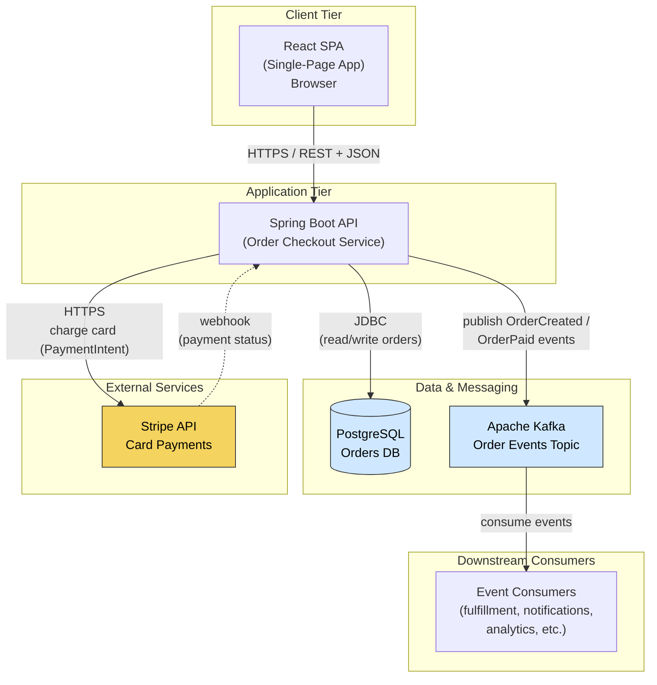

# Order Checkout Service - Architecture Diagram

Here's the architecture for your order checkout service. I've drawn it as a Mermaid diagram (renders directly in GitHub, GitLab, Notion, and most Markdown viewers), followed by a brief walkthrough of each component and the request flow.

## System Diagram

## Component Walkthrough

| Component | Role | Talks to |
|-----------|------|----------|
| **React SPA** | Customer-facing UI running in the browser. Renders the cart/checkout, collects payment details, calls the API. | Spring Boot API over HTTPS/REST |
| **Spring Boot API** | The core checkout service. Validates orders, persists them, orchestrates payment, and emits events. | PostgreSQL, Kafka, Stripe |
| **PostgreSQL** | System of record for orders, line items, and payment state. | Spring Boot API (JDBC) |
| **Apache Kafka** | Event backbone. The API publishes order lifecycle events for asynchronous downstream processing. | API (producer), consumers |
| **Stripe** | Third-party payment processor. Charges customer cards via PaymentIntents and reports results. | API (request + webhook callback) |
| **Event Consumers** | Any services that react to order events (fulfillment, email/SMS notifications, analytics). | Kafka |

## Typical Checkout Flow

1. **Customer submits checkout** — The React SPA sends the order (cart contents, shipping info, Stripe payment token/method) to the Spring Boot API over HTTPS.
2. **Persist the order** — The API writes the order to PostgreSQL, typically in a `PENDING` state.
3. **Charge the card** — The API calls Stripe to create and confirm a PaymentIntent for the order total.
4. **Update + publish** — On a successful charge, the API updates the order status in PostgreSQL (e.g., `PAID`) and publishes an `OrderPaid` event to Kafka.
5. **Downstream reacts** — Consumers pick up the Kafka event to trigger fulfillment, send a confirmation email, update analytics, etc.
6. **Webhook reconciliation** — Stripe sends asynchronous webhooks back to the API to confirm final payment state (handles delayed captures, disputes, async payment methods).

## A Few Design Notes Worth Considering

- **Card data never touches your server.** Use Stripe Elements / Payment Element on the React side so the SPA tokenizes card details directly with Stripe. Your API only ever sees a token/PaymentIntent ID — this keeps you out of most PCI-DSS scope.
- **Always handle the Stripe webhook**, not just the synchronous charge response. Network failures or async payment methods mean the webhook is the authoritative signal for final payment status.
- **Watch the dual-write problem.** Writing to PostgreSQL *and* publishing to Kafka in the same operation can drift if one fails. Consider the **Transactional Outbox pattern** (write the event to an `outbox` table in the same DB transaction, then relay to Kafka via a poller or Debezium CDC) for guaranteed consistency.
- **Make payment + event handling idempotent.** Use an idempotency key on the Stripe call and dedupe Kafka events by order/event ID so retries don't double-charge or double-process.
- **Auth/edge concerns** (not drawn): you'll likely want an API gateway or load balancer, TLS termination, and JWT/session auth between the SPA and API.

---

Want me to take this further? I can produce a **C4 container diagram** (with explicit protocols and deployment boundaries), a **sequence diagram** of the checkout-with-payment flow, or a **deployment diagram** showing how this maps onto your hosting (e.g., Kubernetes, ECS, managed Postgres/Kafka). Just let me know your hosting target.
