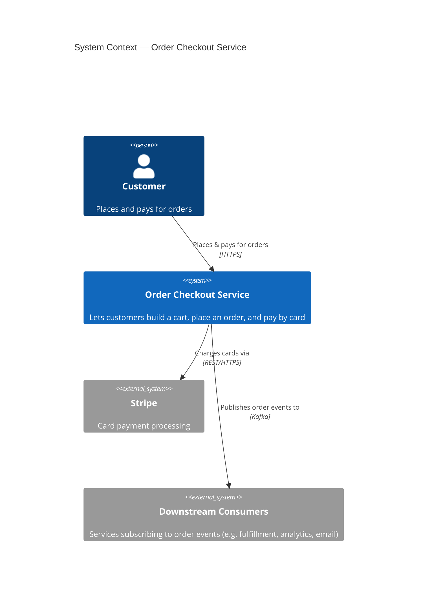
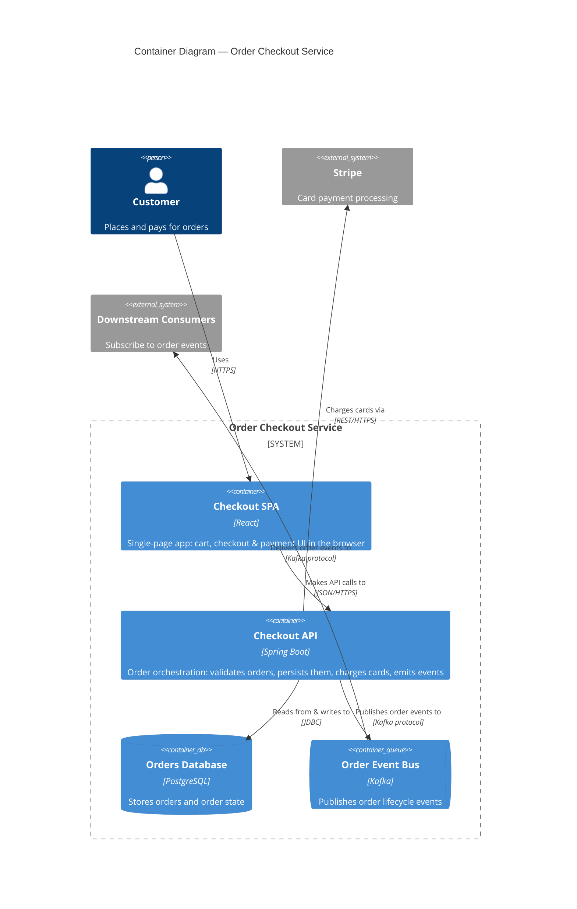

# Order Checkout Service — Architecture Diagram

I'm using the **C4 model** (the standard for diagramming a *single software system* at increasing zoom levels). For your checkout service, two levels answer the question:

- **Level 1 — System Context**: where your service sits among its users and the outside systems it depends on (Stripe).
- **Level 2 — Container**: the runnable/deployable pieces *inside* your service (SPA, API, DB, Kafka) and how they talk.

> A C4 "container" is a separately deployable/runnable unit (an app, an API, a database, a message broker) — **not** a Docker container.

I'm giving you the diagrams as **Mermaid** (renders inline on GitHub and in most Markdown viewers with zero tooling), plus a **Structurizr DSL** workspace as the single source of truth if you want to keep this in the repo and generate more views later.

---

## Level 1 — System Context

What it shows, and for whom: the big picture for *anyone* — your customer, your service as one box, and the external systems it relies on.



> Note: you described *publishing* order events to Kafka but not who consumes them. I've shown **Downstream Consumers** as an external actor so the picture is honest about where those events go. If consumers live inside this same service, move them into the container diagram instead — tell me and I'll adjust.

---

## Level 2 — Container

What it shows, and for whom: the *technical* view — the deployable pieces inside the service and the protocols between them. This is the one your engineers will use.



If `ContainerQueue` doesn't render in your Mermaid version (it's a newer shape), swap it for `Container(kafka, "Order Event Bus", "Kafka", "...")` — the meaning is the same.

---

## Structurizr DSL (model-of-record)

If you keep architecture in the repo, save this as `architecture/workspace.dsl`. Structurizr defines every element **once** and renders many views from it (context, container, and later deployment), so the same "Checkout API" is the same box everywhere — no drift. Render it with Structurizr Lite (free, runs in Docker) or export to PlantUML/Mermaid via the CLI.

```text
workspace "Order Checkout" "Order checkout service: cart, orders, payments" {

    model {
        customer = person "Customer" "Places and pays for orders"

        checkout = softwareSystem "Order Checkout Service" "Cart, order placement and card payment" {
            spa   = container "Checkout SPA" "Cart, checkout & payment UI" "React"
            api   = container "Checkout API" "Order orchestration, persistence, payment, events" "Spring Boot"
            db    = container "Orders Database" "Stores orders and order state" "PostgreSQL" {
                tags "Database"
            }
            kafka = container "Order Event Bus" "Publishes order lifecycle events" "Kafka" {
                tags "Queue"
            }

            spa -> api   "Makes API calls to" "JSON/HTTPS"
            api -> db    "Reads from & writes to" "JDBC"
            api -> kafka "Publishes order events to" "Kafka protocol"
        }

        stripe   = softwareSystem "Stripe" "Card payment processing" {
            tags "External"
        }
        consumer = softwareSystem "Downstream Consumers" "Subscribe to order events" {
            tags "External"
        }

        customer -> spa     "Uses" "HTTPS"
        customer -> checkout "Places & pays for orders" "HTTPS"
        api      -> stripe  "Charges cards via" "REST/HTTPS"
        kafka    -> consumer "Delivers order events to" "Kafka protocol"
    }

    views {
        systemContext checkout "Context" {
            include *
            autolayout lr
        }
        container checkout "Containers" {
            include *
            autolayout lr
        }

        styles {
            element "Person"   { shape person ; background #08427b ; color #ffffff }
            element "External" { background #999999 ; color #ffffff }
            element "Database" { shape cylinder }
            element "Queue"    { shape pipe }
        }
    }
}
```

---

## Legend / notation key

- **Person** (blue figure) — a human user.
- **Boxed system boundary** — the Order Checkout Service; everything inside is something you build and deploy.
- **Grey boxes** — external systems you depend on but don't own (Stripe, downstream consumers).
- **Cylinder** — a data store (PostgreSQL). **Pipe** — a message bus (Kafka).
- **Arrows** — direction of dependency / data flow, labelled with *intent* and *protocol*.

## Assumptions & open questions (worth confirming)

1. **Who consumes the Kafka events?** Shown as external "Downstream Consumers." If a consumer is part of this service, it belongs inside the boundary.
2. **Stripe integration style** — I assumed server-side charges (API → Stripe). If you use Stripe.js / Checkout where the **browser** talks to Stripe directly (card data never hits your API — usually the better PCI posture), that's a different arrow (SPA → Stripe) and worth drawing explicitly. Tell me which and I'll redraw.
3. **Transactional outbox?** Writing to PostgreSQL *and* publishing to Kafka in one operation is a classic dual-write problem. If you need guaranteed consistency between the order row and the emitted event, consider the outbox pattern — happy to record that as an ADR.

Want me to take this further? I can produce a **Component diagram** for the Checkout API internals, a **deployment diagram** (where these containers run), or an **ADR** capturing the Kafka / payments decisions.
